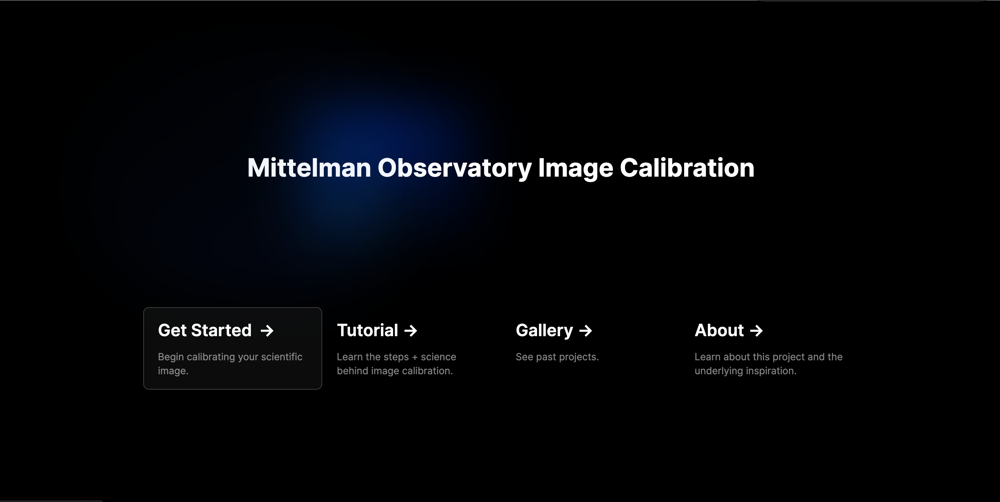
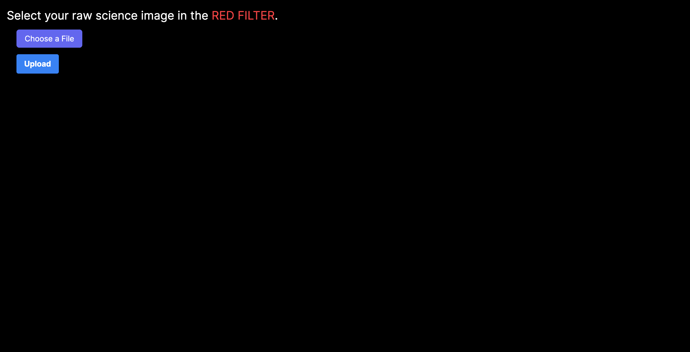
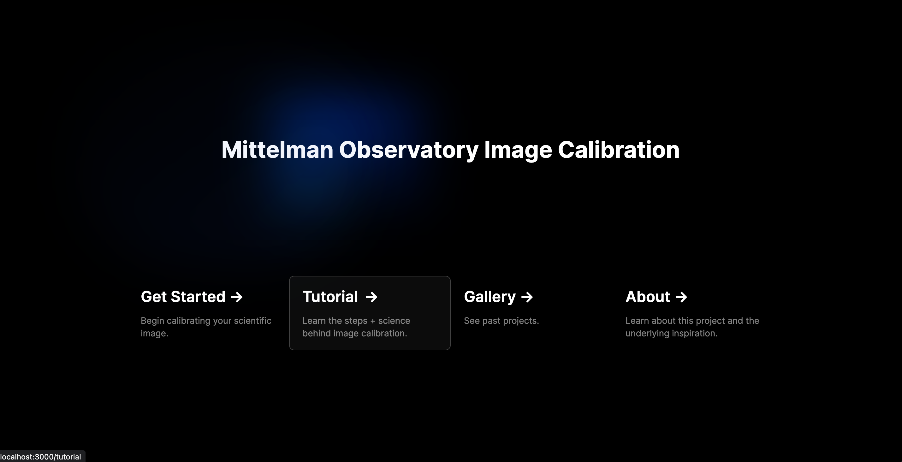
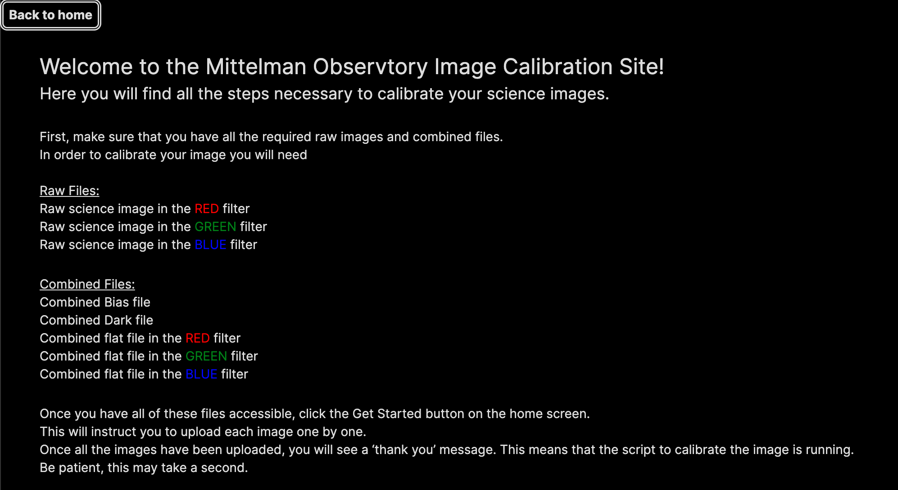

# Mittelman Observatory Image Calibration 

## Middlebury College, CSCI 701 (Senior Seminar, Fall 2023)

## Abstract 

## How to 
Dependencies :
- ```git``` 
- ```flask```
- ```node```
- ```AstroPy```

Cloning the repository
- ```$ git clone git@github.com:csci701f23/space-data-analysis.git```
- 
- ```$ npm install```

Running the Web App:
- ```$ npm run dev```
this will deploy the web page
then, open a second terminal and run 
- ```$ python api/index.py```
this will start the flask server so that the pipeline and gallery will function 


## Examples
Once you have the web app running, use the get started page to calibrate your images 



You will be prompted to upload your .FITs files one by one



The tutorial page lists all the required files for the calibration process 






## Acknowledgements 
We would like to thank Professor Catherine Miller at the Mittelman Observatory for her guidance throughout this project,for providing us with telescope image data, and the AstroPy Python scripts for image calibration processing. 
We would like to thank Professor Philip Caplan for his support and instruction this semester. 

## License
All Mittelman Observatory Image Calibration source code is distributed under the MIT License. 
Copyright 2023 Catie Baxter, Johnny Kantaros and Lila Kosowsky
