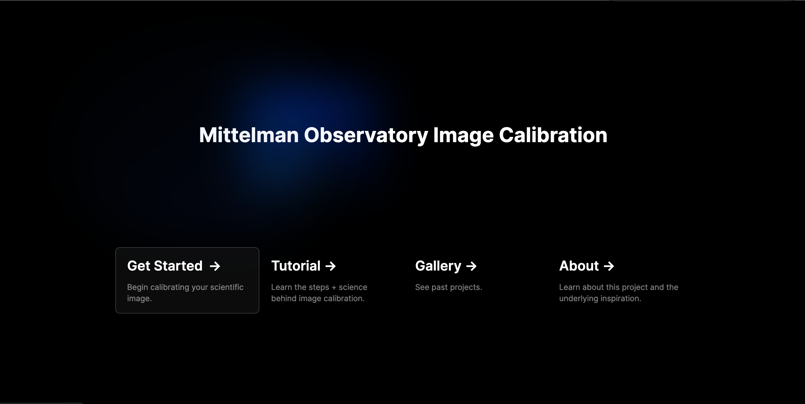
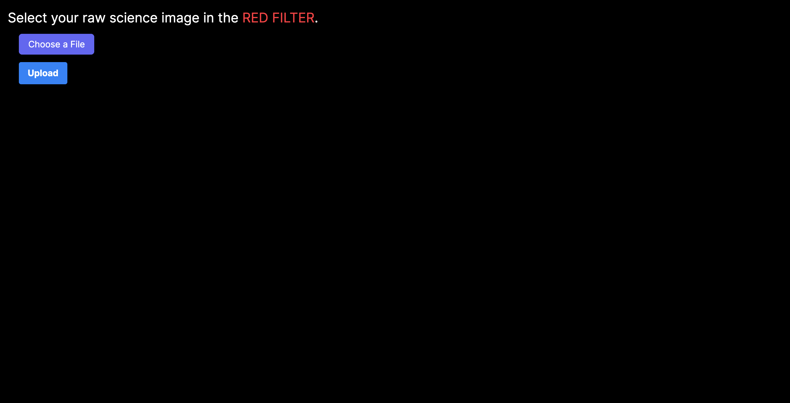
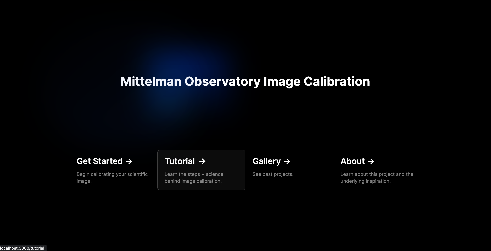
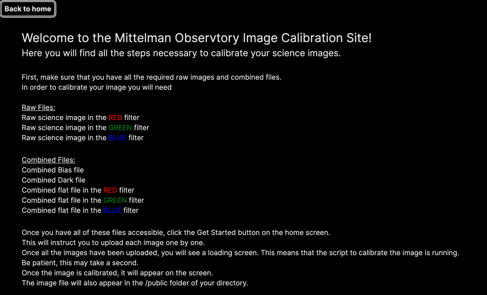

# Mittelman Observatory Image Calibration 

## Middlebury College, CSCI 701 (Senior Seminar, Fall 2023)

## Abstract 
In an effort to make the Mittelman Observatory telescope more accessible to students, we have created a web application to streamline the calibration process for telescope users. Our application utilizes the AstroPy python package and scripts developed by the observatory to create a calibration pipeline. Once fully functional, this pipeline will replace the need to use DS9, an outdated software that is currently used to complete the calibration process. Our current web application consists of the calibration pipeline starting from the combined images and the three raw images, a gallery to display calibrated images, a tutorial page and an about page.

## How to 
Dependencies :
- ```git``` 
- ```flask```
- ```node```
- ```python``` and ```javaScript```
- ```AstroPy```
- ```Tailwind CSS```

Cloning the repository:
- ```$ git clone git@github.com:csci701f23/space-data-analysis.git```
- ```$ npm install```
- ```$ python3 install -r requirements.txt```

Running the Web App:
- ```$ npm run dev```
this will deploy the web page
then, open a second terminal and run 
- ```$ python api/index.py```
this will start the flask server so that the pipeline and gallery will function 


## Examples
Once you have the web app running, use the get started page to calibrate your images 



You will be prompted to upload your .FITs files one by one



The tutorial page lists all the required files for the calibration process 





## Limitations
In the calibration pipeline our web app will not throw an error if the file type is incorrect. So, if the files are not uploaded exactly as specified the pipeline may either fail or produce an incorrect image. It is important to upload the images exactly as prompted for the desired results. 

## Acknowledgements 
We would like to thank Professor Catherine Miller at the Mittelman Observatory for her guidance throughout this project,for providing us with telescope image data, and the AstroPy Python scripts for image calibration processing. 
We would like to thank Professor Philip Caplan for his support and instruction this semester. 

## License
All Mittelman Observatory Image Calibration source code is distributed under the MIT License. 

Copyright 2023 Catie Baxter, Johnny Kantaros and Lila Kosowsky
