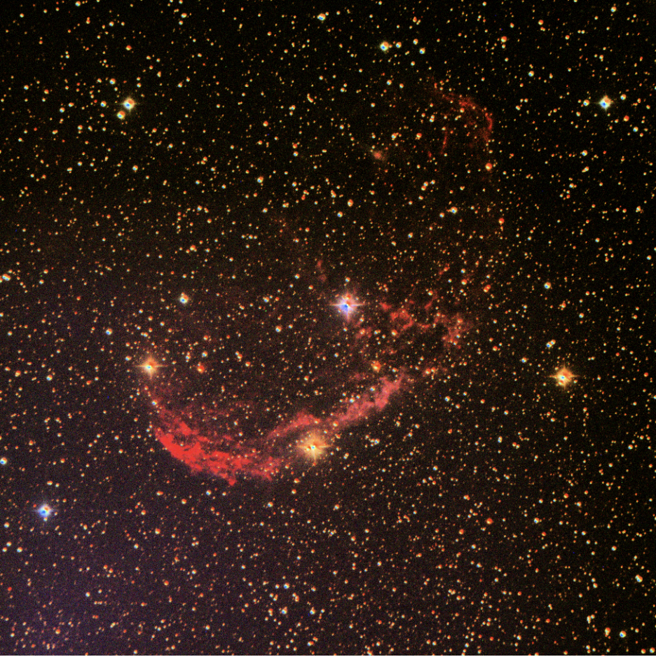
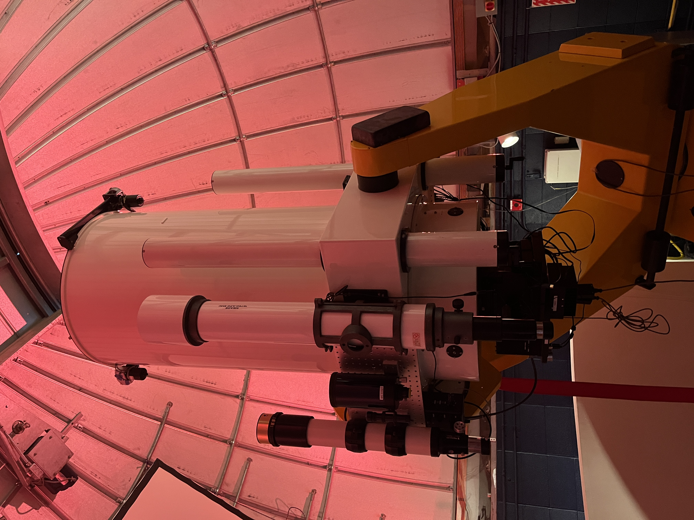
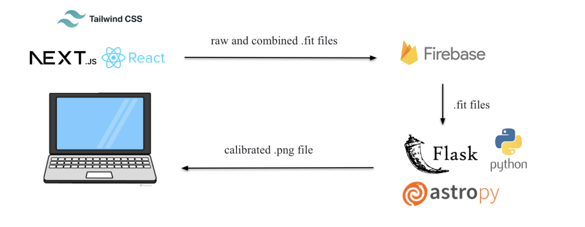
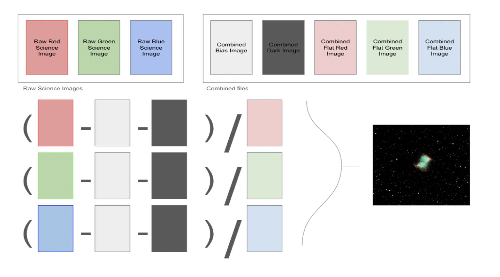
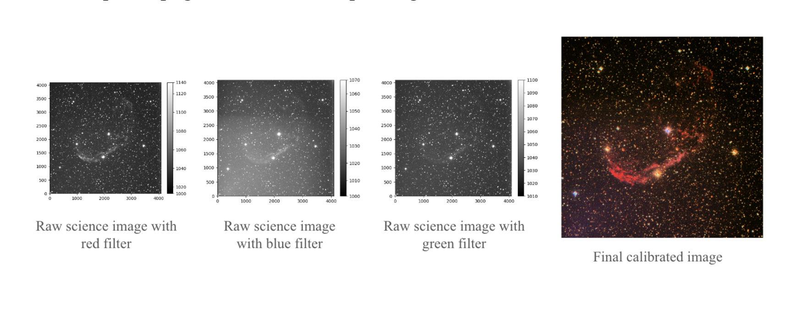
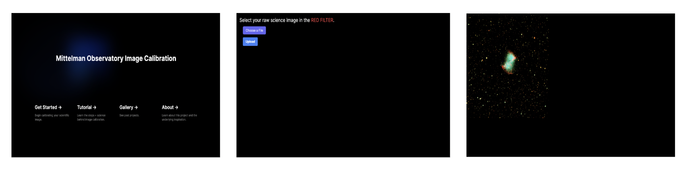

### Mittleman Observatory Image Calibration 

### Introduction

Mittelman Observatory at Middlebury College is the “largest and best equipped”[^Middlebury] institution observatory in the state of Vermont. The aim of this project is to make the Middlebury telescope more accessible to Middlebury students. Many students do not know how to utilize the resources that the telescope provides, as there is currently no streamlined way to process telescope images. Students are taught to use DS9, which is a much older software and has few resources for students to learn the platform. While newly developed AstroPy scripts for calibration do exist within the observatory, being able to run these requires a compiler and knowledge of how to run python scripts. Students will be able to utilize our webapp to take advantage of AstroPy and will be walked through the steps to calibrating their images during the process.

Science image calibration requires three additional types of raw data files: bias images, dark images, and flat images. These images are used to reduce noise, and find the contamination on the telescope in order to increase the accuracy of the science image. The image calibration process begins with the combination of raw files into combined files. The combined files are used to calibrate the science images, before they are aligned and combined. The combined science images are still grayscale images. To create a color image, the three combined science images (one red, one blue, one green) must be combined into a single RGB image.

AstroPy is an open-sourced python package for astronomers that was developed starting in 2011. The package includes tools to simplify processes necessary for image calibration including input and output functionality for FITS files, world coordinate systems in images, cosmological calculations, manipulation of numerical quantities, and the ability for interactive analysis of telescope data[^Robitaille2013]. Currently, the observatory has developed scripts that use AstroPy for the calibration process and our webapp will provide students with the ability to utilize these scripts. In a similar case, an iPython widget was developed for a telescope at the Minnesota State University Moorhead. The goal was to create an easy application for students to calibrate their images with. While the widget format differs from our web app, this case shows the effectiveness of creating a webapp allowing students without programming background to interface with existing python scripts and avoid the need to download and compile them on their machines[^Craig2015]. Our pipeline takes care of passing the image files to the scripts and eliminates the chance of students encountering programming bugs. 

### Methodology 

*Frontend*
We used the Next.js React framework to develop the our web application, utilizing Tailwind CSS for styling. We created individual pages for the image calibration process, gallery, a section detailing how to complete the calibration process, and a section explaining our motivation behind this project. 

*Backend*
In the backend we created python scripts that utilize the AstroPy library. These scripts are integrated with our frontend using Flask. Additionally, we use Firebase to store the gallery images and the .fit files that are uploaded as a part of our calibration process. 

*Telescope Image Calibration*

The image calibration process begins with the combination of raw bias, dark, and flat files into combined files through a series of combination and subtraction steps. Generally, bias and dark frames can be stable for several months, so long as the temperature and exposure times match the science image, but flat images need to be taken of the twilight sky the same night as the science image.

To calibrate an image, the user will upload 8 files: 3 Raw Science Images (Red, Green, and Blue), a combined Bias FITS file, a combined Dark FITS file, and 3 combined Flat FITS files (Red, Green, and Blue). Once the user has uploaded their  files to our web app, the image is calibrated using the Python package AstroPy. 

The script uses two directories, one for the raw science images and one for the calibrated combined files. The raw science images are calibrated by subtracting the combined bias file and combined dark file, and then dividing by the combined flat file in the matching colour filter (red, blue, or green). The calibrated science images are then combined to create a colour image. The output of the script is a png file of the telescope image.

### Results and Future Work
This fall we were able to successfully create our web application with a functioning pipeline to calibrate telescope images starting with the raw science images and five combined files. It will ask the user to upload each file before displaying the RGB image on the webpage, allowing students to download it to their local device. We also implemented a gallery for students to upload their own images and share with peers.

One limitation we faced throughout the semester was the Firebase plan that we opted to use. While the free plan worked for our development and testing stages, it does not include sufficient bandwidth or storage to accommodate more than a few image calibrations in a day. If this were to be widely used by students or members of the observatory, the plan would have to be updated. 

To expand this project, we would like to have the option to extend the pipeline and start with the individual bias dark and flat files and perform the combinations. This would allow students to solely use our platform to calibrate their images. Additionally, there are certain parameters that have been set to default values for our pipeline (such as the softening value and the stretch parameter).In the future allowing users to change these values could be beneficial and allow students to customize their images. In future, the web app could also be expanded to allow for the further analysis of the images, perhaps allowing users to investigate individual pixels. 

### Acknowledgements
We would like to thank Professor Catherine Miller for her guidance throughout this project, for providing us with telescope image data, and the AstroPy Python scripts for image calibration processing. We would like to thank Professor Philip Caplan for his support and assistance this semester.  

### References

[^Craig2015]: Craig, M. *Widgets and Astropy: Accomplishing Productive Research with Undergraduates* PROC. OF THE 14th PYTHON IN SCIENCE CONF. (SCIPY 2015) https://conference.scipy.org/proceedings/scipy2015/pdfs/matthew_craig.pdf 

[^Middlebury]: Middlebury College, *Mittleman Observatory* https://sites.middlebury.edu/observatory/

[^Robitaille2013]: Robitaille, T. et. al. *Astropy: A community Python Package for Astronomy* A&A, 558 (2013) A33 DOI: https://doi.org/10.1051/0004-6361/201322068
